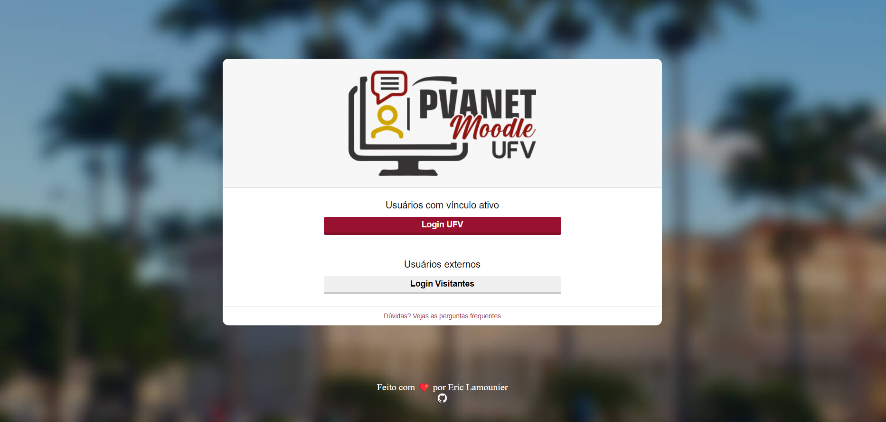

# Cadastro e listagem de produto: Processo seletivo OAK

Projeto construído em estudos básicos iniciais de HTML5 e CSS3 na recriação da página de login da Universidade Federal de Viçosa

[Clique aqui para acessar](https://ericlamounier.github.io/Reproducao-AVA-UFV/)
## Tecnologias

- HTML5
- CSS
- Git e GitHub

## Contato
eric.botelho@ufv.br

eric_lamounier@outlook.com